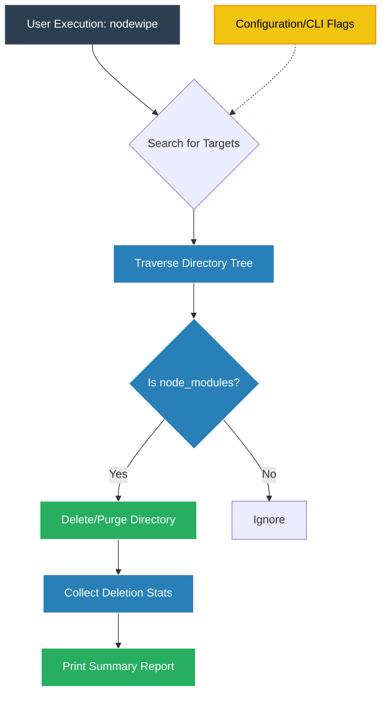

# nodewipe

```
 _   _           _    __        ___            
| \ | | ___   __| | __\ \      / (_)_ __   ___ 
|  \| |/ _ \ / _` |/ _ \ \ /\ / /| | '_ \ / _ \
| |\  | (_) | (_| |  __/\ V  V / | | |_) |  __/
|_| \_|\___/ \__,_|\___| \_/\_/  |_| .__/ \___|
                                   |_|         
```

A Rust dev-environment cleanup tool. Started as a reimagining of
[npkill](https://github.com/voidcosmos/npkill) (see the issue-to-fix mapping
below), but goes further: `node_modules` isn't the only thing that quietly
eats disk space — Python virtualenvs, `__pycache__`, Rust `target/`, Java/Gradle
build output, and JS bundler caches all have the exact same problem. nodewipe
scans for all of them by default, through one shared engine.

## Supported artifact types

| Type | Slug | Detected by |
|---|---|---|
| `node_modules` | `node_modules` | directory name |
| Python venv | `venv` | `venv`/`.venv` name + `pyvenv.cfg` inside |
| Python bytecode cache | `pycache` | `__pycache__` |
| pytest cache | `pytest_cache` | `.pytest_cache` |
| mypy cache | `mypy_cache` | `.mypy_cache` |
| ruff cache | `ruff_cache` | `.ruff_cache` |
| Rust build output | `rust_target` | `target/` + sibling `Cargo.toml` |
| Maven build output | `maven_target` | `target/` + sibling `pom.xml` |
| Gradle build output | `gradle_build` | `build/` + sibling `build.gradle(.kts)` |
| Next.js cache | `next_cache` | `.next` |
| Turborepo cache | `turbo_cache` | `.turbo` |
| JS bundler output | `dist` | `dist/` + sibling `package.json` |

Everything is scanned by default (`nodewipe scan`); opt individual types out
with `nodewipe --exclude-types venv,dist`, or list them all with `nodewipe types`.
Ambiguous names like `target`/`build`/`dist` are only matched when a marker
file confirms the ecosystem (e.g. `target/` next to `Cargo.toml`), so an
unrelated folder that happens to share the name is never touched.

## Status: MVP scaffold

What's implemented right now:
- **`core`**: rule-based scanner covering all the artifact types above
  (adding a new one is a one-line rule, not a rewrite), monorepo/workspace
  grouping, three delete modes (trash / archive / permanent).
- **`cli`**: interactive TUI (default when run in a terminal — `↑/↓` move,
  `space` select, `d` trash, `a` archive, `p` permanent w/ confirmation,
  `r` rescan, `q` quit), plus `scan`/`delete`/`types` subcommands, a
  `--exclude-types` filter, and a `--json` (headless/scriptable) output mode.
- **`gui`**: Tauri desktop app (npkill#186) — search/filter, per-type filter
  chips, flat and collapsible grouped (monorepo) views, sortable columns,
  select-all, colored type badges, a real confirmation modal for permanent
  delete, and toast notifications. Same `nodewipe-core` engine as the CLI.
- **Distribution scaffolding**: GitHub Actions release workflow, an
  `install.sh` that asks CLI-only vs CLI+GUI, and an npm shim published as
  [`@joker53/nodewipe`](https://www.npmjs.com/package/@joker53/nodewipe) — see
  "Installing" below. The npm package is live; it just has nothing to
  download yet until the first GitHub Release with built binaries exists.

What's *not* built yet (next steps, see Roadmap):
- `.nodewipeignore` / exclude-pattern config file.
- Progress bar during long scans (current TUI/GUI block until the initial scan finishes).
- Custom app icons for GUI bundling (placeholders in place for now).

## Installing

The npm shim is already published as [`@joker53/nodewipe`](https://www.npmjs.com/package/@joker53/nodewipe)
(scoped under a personal npm username — a plain `nodewipe` name was blocked by
npm's collision check against an existing similarly-named package). Three ways
to get it, from simplest to most manual:

```bash
# 1. npm — downloads the right native binary via postinstall,
#    no Rust/Node build step for the end user
npx @joker53/nodewipe
# or: npm install -g @joker53/nodewipe

# 2. Shell installer — asks CLI-only vs CLI+GUI
curl -fsSL https://raw.githubusercontent.com/KADHIRAVANEG/nodewipe/main/scripts/install.sh | bash

# 3. Manual — grab the binary for your platform from GitHub Releases
#    https://github.com/KADHIRAVANEG/nodewipe/releases
```

None of these compile anything locally — `.github/workflows/release.yml` builds
native binaries for Linux/macOS/Windows on every version tag and attaches them
to a GitHub Release; the npm package and `install.sh` just fetch the matching
one. **This only works once a tagged release has actually been pushed and
built.** Until then (or if a build fails for your platform), build from source
(next section).

### Publishing a new release

```bash
git tag vX.Y.Z
git push origin vX.Y.Z
```
This triggers the GitHub Actions workflow to build and attach binaries — check
progress at https://github.com/KADHIRAVANEG/nodewipe/actions. The npm shim only
needs re-publishing when its own code changes (not on every binary release):
```bash
cd npm-package
npm version patch   # or minor/major
npm publish --access=public
```

## Building from source

```bash
cd nodewipe
cargo build --release
./target/release/nodewipe scan
```

## Building the GUI

Requires Node.js/npm in addition to Rust, plus Tauri's native dependencies:
- **Linux**: `webkit2gtk-4.1`, `libappindicator-gtk3`, `librsvg`, and build
  tools — see https://v2.tauri.app/start/prerequisites/ for your distro's
  exact package names (they vary, especially on Arch).
- **macOS**: Xcode Command Line Tools (`xcode-select --install`).
- **Windows**: Microsoft C++ Build Tools + WebView2 (usually already present on Win10/11).

```bash
cd gui
npm install
npm run dev      # launches the app in dev mode with hot reload
npm run build    # produces a distributable bundle
```

## Usage (CLI)

```bash
# Interactive TUI (default when run in a terminal)
nodewipe

# Human-readable scan of the current directory (all artifact types)
nodewipe scan

# Only show artifacts >= 50MB
nodewipe scan --min-mb 50

# Group results by monorepo/workspace root
nodewipe scan --grouped

# Skip specific artifact types
nodewipe scan --exclude-types venv,dist,rust_target

# List every supported type and its slug
nodewipe types

# Launch the desktop GUI (if installed alongside this CLI)
nodewipe gui

# Scriptable / CI mode
nodewipe scan --json > report.json

# Delete: safe by default (moves to OS trash), requires --yes for automation
nodewipe delete ./apps/foo/node_modules --yes

# Archive before deleting
nodewipe delete ./apps/foo/node_modules --mode archive --yes

# Preview only
nodewipe delete ./apps/foo/node_modules --dry-run
```

## Issue-to-fix mapping (voidcosmos/npkill)

| npkill issue | What this project does differently |
|---|---|
| #188 no headless/scriptable mode | `--json` output + `--yes`/`--dry-run` flags + proper exit codes |
| #199 / #191 nested directory bugs | Scanner prunes recursion only at matched `node_modules`; sibling branches are never affected (see comments in `core/src/scanner.rs`) |
| #104 no grouped/collapsed view | `workspace::group_by_workspace` groups by detected monorepo root |
| #172 / #121 slow scan/delete | `rayon`-parallel directory walk and parallel size computation |
| #60 no trash/undo | `DeleteMode::Trash` moves to OS trash instead of unlinking |
| #46 no archive option | `DeleteMode::Archive` tars+gzips before removing |
| #75 pnpm/Windows issues | Package manager detected from lockfile; `.pnpm` treated as part of one deletable unit, not a nested result |
| #186 no desktop app | `gui/` — Tauri app wrapping the same `nodewipe-core` engine |

## Roadmap

1. ✅ Core scanning + deletion engine, scriptable CLI
2. ✅ Interactive terminal UI with `ratatui`, multi-select, trash/archive/permanent
3. ✅ Tauri GUI wrapping `nodewipe-core` (no engine code duplicated)
4. `.nodewipeignore` config file + `--exclude` glob support
5. Custom app icons + packaging: prebuilt binaries/installers via GitHub Actions for macOS/Linux/Windows
6. Benchmark suite vs. npkill on a large monorepo fixture, published in README

## Project layout

```
nodewipe/
├── core/     # nodewipe-core: engine, no I/O with the user — reusable by CLI and GUI
├── cli/      # nodewipe-cli: binary, argument parsing, output formatting, TUI
└── gui/      # nodewipe-gui: Tauri desktop app (src-tauri/ = Rust backend, rest = frontend)
```

## Chart

